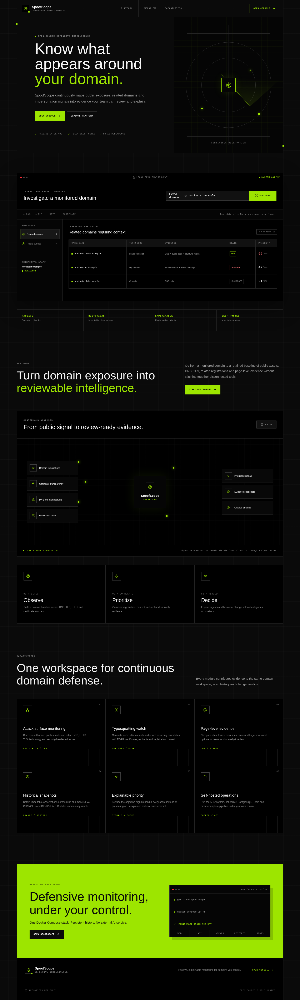
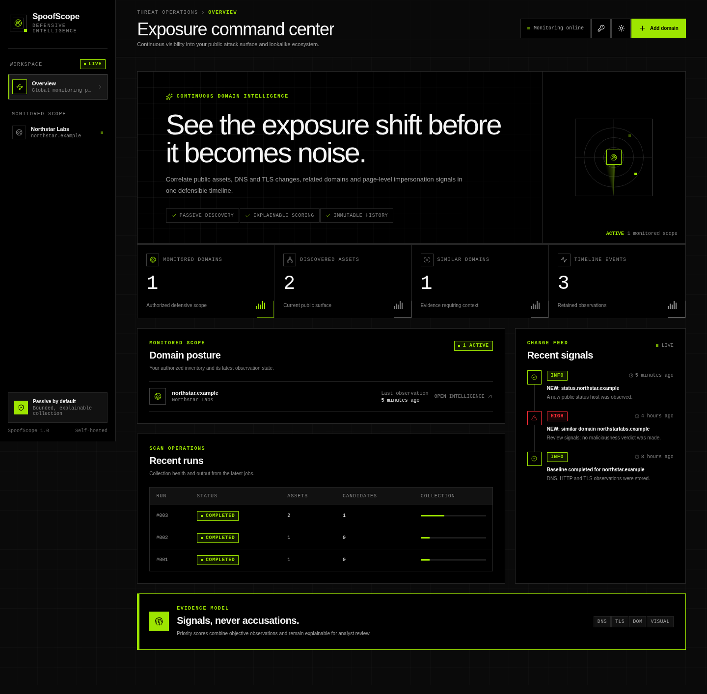
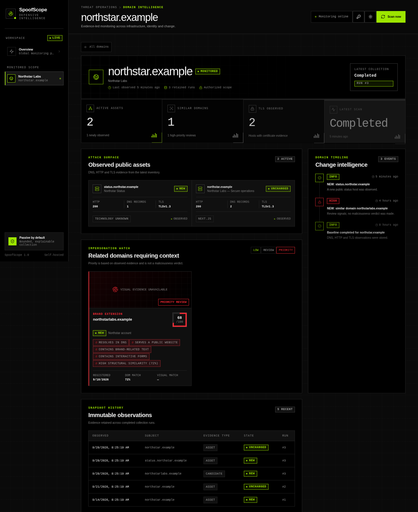

# SpoofScope

**Self-hosted defensive monitoring for domain exposure, typosquatting, and brand impersonation.**

SpoofScope continuously records the public-facing assets of domains you are authorized to monitor, discovers lookalike registrations, and explains the web signals that make them worth reviewing. It preserves evidence over time without automatically accusing a domain of phishing or malicious activity.



The public page includes a local interactive product preview and an animated
signal-flow explanation. It does not contact monitored domains or call the
authenticated API. The operational console remains available at `/app`.

## Why SpoofScope

- **Know what appeared:** Certificate Transparency, DNS, HTTP/S, TLS, redirects, titles, favicons, technologies, and security headers.
- **Review lookalikes early:** omissions, duplication, transposition, substitutions, Unicode homoglyphs, hyphenation, keyword affixes, and alternate TLDs.
- **See evidence, not labels:** RDAP dates, forms, password inputs, brand text, DOM similarity, visual similarity, redirects, and external resources.
- **Understand change:** immutable snapshots and explicit `NEW`, `CHANGED`, `UNCHANGED`, and grace-based `DISAPPEARED` states.
- **Keep control:** fully self-hosted, no AI service, no SaaS dependency, configurable retention, API-key protection, and bounded passive collection.





SpoofScope does not brute-force services, exploit hosts, collect submitted credentials, bypass authentication, or treat similarity as proof of malicious intent.

## Quick start

Requirements: Docker Engine and Docker Compose v2.

```bash
git clone https://github.com/JMDcore/spoofscope.git
cd spoofscope
cp .env.example .env
```

Replace `POSTGRES_PASSWORD` and `SPOOFSCOPE_API_KEY` in `.env` with long random values, then start the platform:

```bash
docker compose up -d --build
docker compose ps
```

By default, Compose binds the interface only to `127.0.0.1:8080`; it is not exposed on the host's LAN interfaces. Open `http://localhost:8080` when browsing on the Docker host, or use an SSH local port forward from a remote workstation:

```bash
ssh -N -L 127.0.0.1:8080:127.0.0.1:8080 user@docker-host
```

The root URL presents the product overview and safe interactive demo. Select
**Open console** to enter `/app`, then use the key button in the header to enter
the API key from `.env`.

To populate a safe demonstration workspace immediately:

```bash
docker compose exec api python scripts/seed_demo.py
```

The demo uses reserved `.example` names and documentation-only IP addresses. It does not make monitoring requests.

## Capabilities

### Attack Surface Monitor

- Certificate Transparency discovery through `crt.sh`.
- Conservative common-host fallback discovery.
- A, AAAA, CNAME, MX, NS, TXT, and CAA observations.
- Public HTTP/S reachability, redirects, status, content type, title, and favicon.
- TLS version, subject, issuer, SANs, and validity dates.
- Lightweight technology indicators and security-header inventory.
- Complete per-run snapshots with configurable retention.
- Consecutive-miss grace period before an asset becomes `DISAPPEARED`.

### Typosquatting Monitor

- Omissions, duplication, transposition, hyphenation, and visual substitutions.
- IDN/Unicode homoglyph variants converted safely to punycode.
- TLD swaps and common defensive keyword affixes.
- DNS, HTTP/S, TLS, RDAP registration/change/expiration dates, and nameservers.
- Explainable review-priority scores. Scores are not maliciousness verdicts.

### Phishing Watch

- HTML hash and stable DOM-structure fingerprint.
- Forms, password inputs, brand mentions, redirects, and external-resource hosts.
- Structural Jaccard similarity against the monitored site.
- Optional Playwright screenshots and perceptual difference hashes.
- Visual similarity signal against the monitored site's baseline.
- SSRF controls that reject loopback, private, link-local, and other non-public targets.

## Architecture

```text
Browser
  │
  ▼
Nginx + React/TypeScript UI
  │
  ▼
FastAPI ─────────────── PostgreSQL
  │                         │
  ├── Redis / RQ worker ────┤ immutable observations
  │                         │ inventory + events
  └── APScheduler ──────────┘
          │
          ▼
  bounded DNS / TLS / HTTP / CT / RDAP / Playwright collection
```

| Component | Technology | Purpose |
| --- | --- | --- |
| Web | React, TypeScript, Vite | Responsive dashboard, domain workspace, history, evidence |
| API | FastAPI, Pydantic | Validation, authentication, history API, metrics, job dispatch |
| Data | PostgreSQL, SQLAlchemy, Alembic | Durable inventory, immutable snapshots, scans, events |
| Jobs | Redis, RQ, APScheduler | Isolated collection, retries, scheduled monitoring |
| Browser | Playwright Chromium, Pillow | Screenshots and perceptual fingerprints |
| Edge | Nginx | Static delivery, reverse proxy, CSP and browser security headers |

## Detection and prioritization

Candidate scores are additive review signals:

| Signal | Weight |
| --- | ---: |
| Resolves in public DNS | 20 |
| Serves a public website | 15 |
| Brand-related text | up to 20 |
| Password input | 25 |
| Other forms | 8 |
| Redirect behavior | 5 |
| Moderate/high DOM similarity | 6 / 12 |
| High visual similarity | 12 |

False positives are normal: defensive registrations, unrelated brands, parked domains, and shared infrastructure can all produce signals. Human review and independent evidence remain necessary.

## Configuration

All application settings use the `SPOOFSCOPE_` prefix.

| Variable | Default | Purpose |
| --- | --- | --- |
| `SPOOFSCOPE_API_KEY` | empty locally | Protects all API routes except health |
| `SPOOFSCOPE_PORT` | `8080` | Published web port |
| `SPOOFSCOPE_DATABASE_URL` | SQLite for local development | SQLAlchemy database URL |
| `SPOOFSCOPE_REDIS_URL` | `redis://redis:6379/0` | RQ connection |
| `SPOOFSCOPE_SCAN_INTERVAL_MINUTES` | `360` | Periodic collection interval |
| `SPOOFSCOPE_SCAN_TIMEOUT_SECONDS` | `8` | Per-operation network timeout |
| `SPOOFSCOPE_MAX_CANDIDATES` | `120` | Candidate cap per domain/run |
| `SPOOFSCOPE_MAX_CT_HOSTS` | `200` | Certificate Transparency host cap per run |
| `SPOOFSCOPE_CT_ENABLED` | `true` | Enables Certificate Transparency discovery |
| `SPOOFSCOPE_SCREENSHOTS_ENABLED` | `true` | Enables bounded Playwright capture |
| `SPOOFSCOPE_MAX_SCREENSHOTS_PER_SCAN` | `8` | Screenshot cap per run |
| `SPOOFSCOPE_SCREENSHOT_THRESHOLD` | `35` | Minimum candidate score for capture |
| `SPOOFSCOPE_DISAPPEARANCE_GRACE_SCANS` | `2` | Misses required for `DISAPPEARED` |
| `SPOOFSCOPE_RETENTION_DAYS` | `180` | Snapshot and screenshot retention |
| `SPOOFSCOPE_REQUEST_RATE_PER_SECOND` | `4` | Outbound request pacing |

See [.env.example](.env.example) for deployment defaults.

## Operations

- Health: `GET /api/health`
- Prometheus text metrics: `GET /api/metrics`
- OpenAPI/Swagger: `/api/docs` — click **Authorize** and provide `X-SpoofScope-Key`.
- Application logs are structured JSON in containers.
- Failed RQ scans retry after 1, 5, and 15 minutes.
- Snapshots and screenshots older than the retention period are removed after successful scans.

Back up the PostgreSQL and `screenshot_data` volumes together if screenshot-to-snapshot consistency matters.

## Local development

Requirements: Python 3.11+ and Node.js 22.22.2+.

```bash
python3 -m venv .venv
source .venv/bin/activate
pip install -e '.[dev]'
alembic upgrade head
uvicorn spoofscope.main:app --reload
```

In another terminal:

```bash
cd web
npm ci
npm run dev
```

Quality and security checks:

```bash
ruff check .
pytest
pip-audit --skip-editable
cd web
npm test
npm run build
npm audit
```

Full clean-install Docker test:

```bash
scripts/e2e.sh
```

This builds every image, starts PostgreSQL/Redis/API/worker/scheduler/web, loads the demo, creates an authorized test scope, executes a worker scan, queries metrics, and destroys its isolated volumes afterward.

## Security and privacy

- Only monitor domains you control or are explicitly authorized to assess.
- Use TLS and an authenticating reverse proxy when exposing SpoofScope beyond a trusted network.
- The built-in API key is intended for a single-tenant deployment; rotate it if exposed.
- Screenshots can contain personal or sensitive public content. Choose an appropriate retention period and protect backups.
- Public DNS can change between validation and connection. SpoofScope performs public-address checks, but network-level egress controls remain recommended for high-assurance deployments.
- Collection is intentionally bounded, paced, and limited to public metadata/root pages.

Read [SECURITY.md](SECURITY.md) before production deployment.
Operational guidance, backups, upgrades, reverse proxying, and hardening are covered in [docs/DEPLOYMENT.md](docs/DEPLOYMENT.md).

## Release quality

Version 1.0.0 is covered by unit, scan-flow, PostgreSQL, Redis-worker, migration, API smoke, browser E2E, responsive visual, Python dependency, and npm dependency checks. GitHub Actions repeats backend, frontend, service-integration, and clean Docker Compose tests on every pull request.

## Known boundaries

- Technology detection is heuristic rather than a full fingerprinting engine.
- CT and RDAP availability depends on public upstream services and their rate limits.
- The authentication model is single-tenant API-key access, not multi-user RBAC.
- SpoofScope supports analyst triage; it is not a legal attribution or automated takedown system.

## Contributing

Read [CONTRIBUTING.md](CONTRIBUTING.md) and [CODE_OF_CONDUCT.md](CODE_OF_CONDUCT.md). New collectors must remain passive, bounded, explainable, and testable.

## License

MIT — see [LICENSE](LICENSE).
